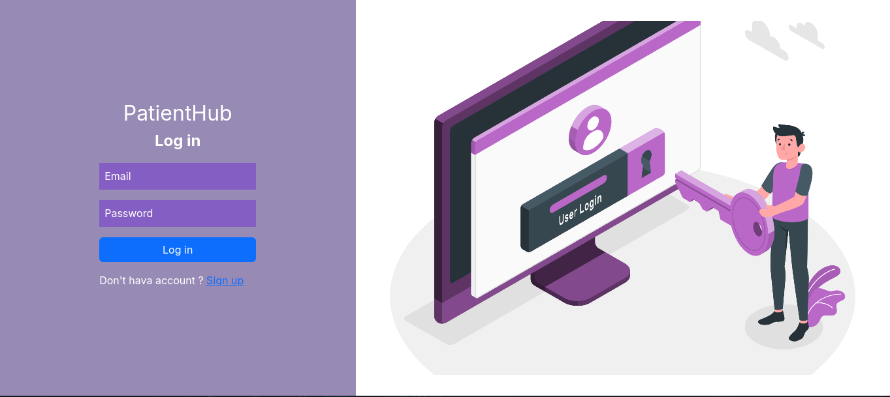
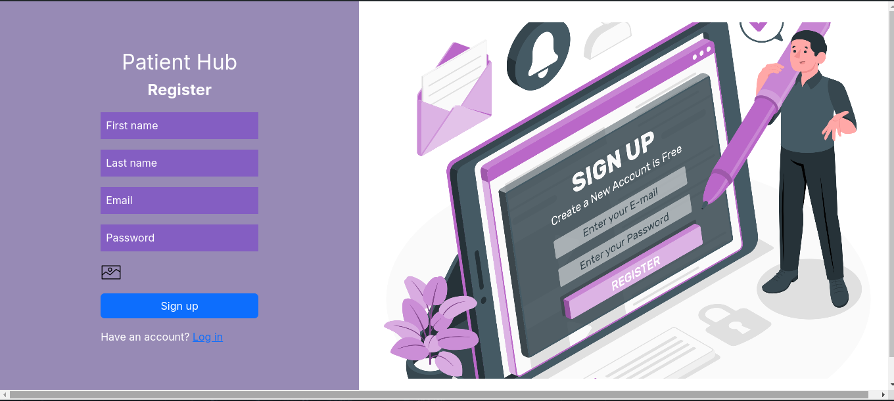
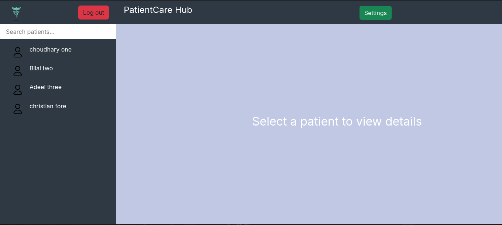
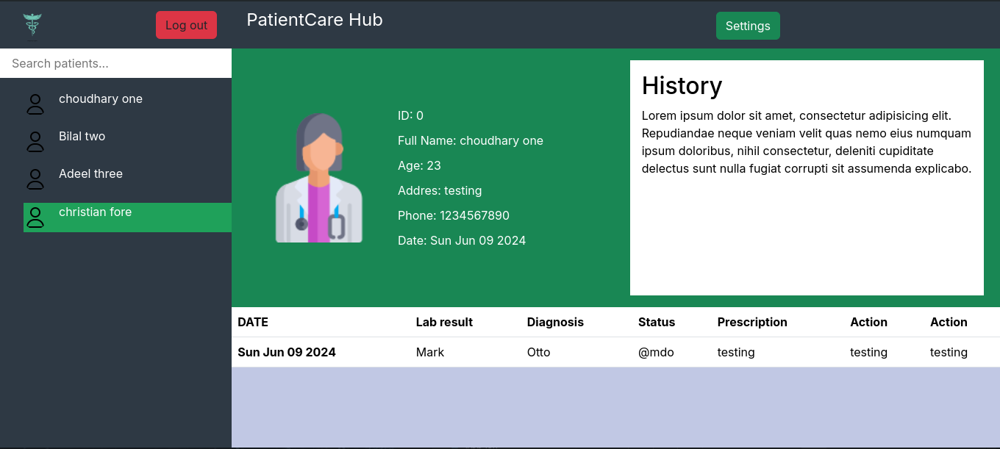

# PatientCare-Hub
PatientCare-Hub is a React web application designed to store patient data and allow doctors to access past patient history and data. The application is currently under development and does not yet have a backend.

## Features
#### Login Page: Access by navigating to /login.
#### Signup Page: Access by navigating to /signup.
#### Home Page: Main interface for users.
#### Not Found Page: Handles invalid URL entries.

## Upcoming Features
#### Realtime chat between doctor and patient
#### video chat

## Pages and Routes
#### Login Page: /login

Allows existing users (doctors) to log in to the application.
#### Signup Page: /signup

Allows new users to sign up for an account.
#### Home Page: /

The main dashboard where users can view and manage patient data.
Not Found Page: Displays when an invalid URL is accessed.

## Installation
To run this project locally, follow these steps:

#### Clone the repository:
```
git clone https://github.com/efa07/PatientCare-Hub
```
#### Navigate to the project directory:
```
cd PatientCare-Hub
```
#### Install dependencies:
```
npm install
```
#### Start the development server:
```
npm start
```
The application will be available at http://localhost:3000.

## Contributing
Contributions are welcome! Please open an issue or submit a pull request for any changes or improvements.

#### Fork the repository.

#### Create a new branch:
```
git checkout -b feature-branch
```
#### Make your changes and commit them:
```
git commit -m 'Add some feature'
```
#### Push to the branch:
```
git push origin feature-branch
```
Submit a pull request.

## Sample
### /login


### /signup


### /Home


### /


Contact
For any questions or suggestions, please contact:

Name: Efa Tariku
Email: efatariku07@gmail.com

